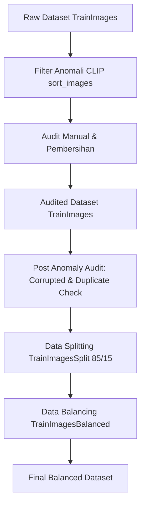

# Preprocessing Dataset - Project BDC

## Summary of Preprocessing Flow

---

## 1. Anomaly Filter (`preprocess/sort_images`)

Initial stage to sort the raw dataset in the [`TrainImages`](./TrainImages) folder and detect anomalies (image category errors) using a zero-shot approach.

- **Classification Method**: Using the **CLIP** model (`open_clip` with default architecture `ViT-B-32` and pretrained weights `laion2b_s34b_b79k`) via [`classifier_clip.py`](./preprocess/sort_images/classifier_clip.py).
- **Prompting**: Image similarity is matched with text descriptions of categories defined in [`prompts.json`](prompts.json):
  - **Recyclable Objects**: _"a photo of a recyclable object, like a bottle, can, or cardboard box"_, etc.
  - **Electronic Objects**: _"a photo of an electronic device, like a phone, laptop, or cable"_, etc.
  - **Organic Objects**: _"a photo of organic waste, like food scraps, fruit, or vegetables"_, etc.
- **Filtering**: Images are moved to `anomaly` if the predicted class does not match the original folder category.
- **Manual Audit**: The filtering results in the `anomaly` and `non_anomaly` folders are reviewed manually. The original raw dataset is moved out of the project, and the clean manual audit results are moved back into the [`TrainImages`](./TrainImages) folder.
- **Total Images Post Audit**: **24,717 images**.

---

## 2. Post Anomaly Audit (`preprocess/post_anomaly_audit`)

- **Corrupted File Detection ([`check_corrupted_images.py`](./preprocess/post_anomaly_audit/check_corrupted_images.py))**:
  - Verifying image structure integrity with `Image.verify()` and performing full pixel decoding with `Image.load()`.
  - Obtained **0 corrupted files**.
- **Duplicate Image Detection ([`find_duplicates.py`](./preprocess/post_anomaly_audit/find_duplicates.py))**:
  - _Exact Duplicates_: Using **MD5 hashing** to find files that are 100% identical byte-per-byte.
  - _Near-Duplicates_: Using **Perceptual Hashing (pHash)** based on 2D DCT (Discrete Cosine Transform) with a Hamming Distance threshold $\le 3$.
  - _Keeper Criteria_: Prioritizing images with the highest resolution (width $\times$ height), then the smallest alphabetical filename.
  - _Quarantine Results_: There were **512 duplicate files** detected and quarantined to the [`TrainImages/duplicates`](./TrainImages/duplicates) folder with the following details:
    - **Exact Duplicates (59 images)**: `0_Recyclable` (10), `1_Electronic` (28), `2_Organic` (21).
    - **Near-Duplicates (453 images)**: `0_Recyclable` (104), `1_Electronic` (292), `2_Organic` (57).

---

## 3. Data Splitting (`preprocess/split_dataset`)

The clean dataset is split into training (train) and validation (val) data in a stratified manner (class proportions are maintained in both splits).

- **Method**: Using the [`split_dataset.py`](./preprocess/split_dataset/split_dataset.py) script with validation ratio parameter **0.15 (15%)** and random seed `729`.
- **Split Results Distribution ([`TrainImagesSplit`](./TrainImagesSplit))**:

| Class Name       | Total Original | Train Split (85%)  |  Val Split (15%)  |
| :--------------- | :------------: | :----------------: | :---------------: |
| **0_Recyclable** |     9.132      |   7.762 (85.0%)    |   1.370 (15.0%)   |
| **1_Electronic** |     3.565      |   3.030 (85.0%)    |    535 (15.0%)    |
| **2_Organic**    |     12.020     |   10.217 (85.0%)   |   1.803 (15.0%)   |
| **Total**        |   **24.717**   | **21.009 (85.0%)** | **3.708 (15.0%)** |

---

## 4. Data Balancing (`preprocess/data_balancing`)

Addresses class imbalance in the training data (train split) to prevent model bias towards the majority class. The target balancing is set around **8,000 images** per class.

- **Oversampling on Minority Class (`1_Electronic` | 3.030 $\rightarrow$ 8.000 images)**:
  - Uses dynamic _targeted augmentation_ via [`oversample.py`](./preprocess/data_balancing/oversample.py).
  - **Augmentation Parameters**: Defined in [`config.json`](./preprocess/data_balancing/config.json)
- **Undersampling on Majority Class (`2_Organic` | 10.217 $\rightarrow$ 8.000 images)**:
  - Uses _diversity-preserving undersampling_ via [`undersample.py`](./preprocess/data_balancing/undersample.py) to minimize the loss of important information.
  - **Feature Extraction**: Visual embedding extraction using pre-trained `efficientnet_b0` model.
  - **Clustering & Selection**: Runs `MiniBatchKMeans` algorithm with $k = target\_amount$ clusters.
- **Passthrough (`0_Recyclable` | 7.762 $\rightarrow$ 7.762 images)**:
  - Kept as-is because the count is already very close to the target of 8,000 images.

### Comparison of Distribution Before vs After Balancing (Train Split)

| Class Name       | Before Balancing | After Balancing | Preprocessing Action                 |
| :--------------- | :--------------: | :-------------: | :----------------------------------- |
| **0_Recyclable** |      7.762       |      7.762      | Passthrough (Keep As-Is)             |
| **1_Electronic** |      3.030       |      8.000      | Oversampling (Targeted Augmentation) |
| **2_Organic**    |      10.217      |      8.000      | Undersampling (K-Means Clustering)   |
| **Total Train**  |    **21.009**    |   **23.762**    | **Balanced Train Set**               |

> [!NOTE]
> Validation dataset (Validation Split) in [`TrainImagesBalanced/val`](./TrainImagesBalanced/val) **did not undergo any modification (oversampling/undersampling)** to ensure objective model performance evaluation on the original data with a total of **3.708 images**.
